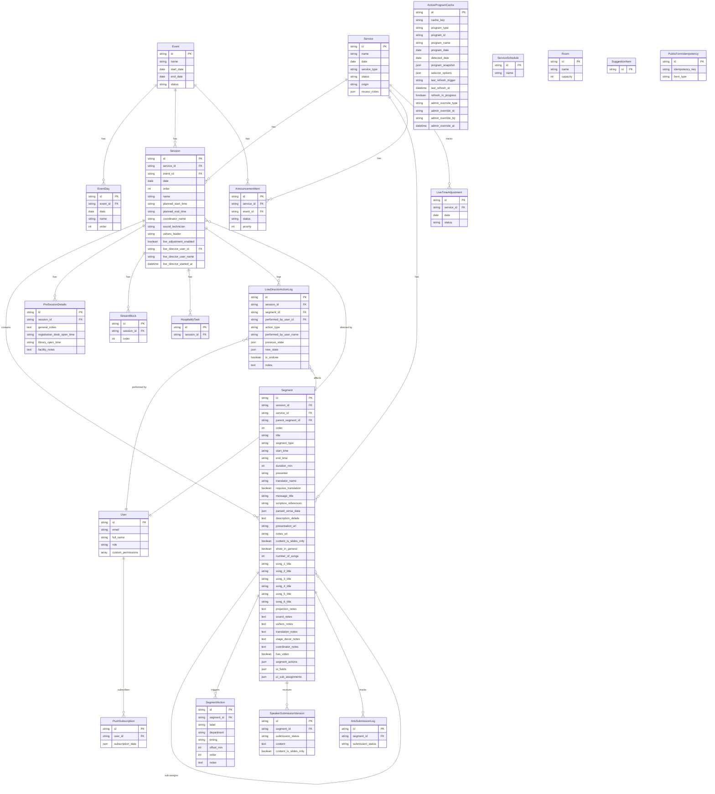

# PDV Event Pro — Entity Relationship Diagram

## Relationship Summary

| Relationship | Type | Description |
|---|---|---|
| Service → Session | One-to-Many | A service has multiple time-slot sessions |
| Service → Segment | One-to-Many | Segments are scoped to a service |
| Service → AnnouncementItem | One-to-Many | Announcements displayed in a service |
| Service → LiveTimeAdjustment | One-to-Many | Real-time timing adjustments |
| Event → EventDay | One-to-Many | Multi-day events composed of days |
| Event → Session | One-to-Many | Event sessions (alternative to service sessions) |
| Event → AnnouncementItem | One-to-Many | Announcements for events |
| Session → Segment | One-to-Many | Program items within a session |
| Session → PreSessionDetails | One-to-Many | Setup details before session |
| Session → StreamBlock | One-to-Many | Video/stream management blocks |
| Session → HospitalityTask | One-to-Many | Operational tasks per session |
| Session → LiveDirectorActionLog | One-to-Many | Audit trail of director actions |
| Segment → Segment | Self-referential | Sub-assignments (child segments) |
| Segment → SegmentAction | One-to-Many | Tasks triggered by a segment |
| Segment → SpeakerSubmissionVersion | One-to-Many | Versioned speaker content |
| Segment → ArtsSubmissionLog | One-to-Many | Arts/media submission tracking |
| User → PushSubscription | One-to-Many | Browser push notification subscriptions |
| User → Session | One-to-Many | Live director ownership of session |
| User → LiveDirectorActionLog | One-to-Many | Actions performed by user |

## Notable Design Notes

- **Dual-parent Sessions**: A `Session` can belong to either a `Service` OR an `Event` (nullable FKs)
- **Denormalized Songs**: `Segment` stores up to 6 songs as flat fields (`song_1_title`…`song_6_title`) rather than a separate Song entity
- **Embedded JSON**: `Segment` embeds `segment_actions`, `ui_fields`, and `ui_sub_assignments` as JSON columns alongside the normalized `SegmentAction` entity
- **Cache Layer**: `ActiveProgramCache` pre-computes full program snapshots for fast display loading — not a source-of-truth entity
- **Self-Referential Segments**: `parent_segment_id` enables nested sub-assignments (e.g., Ministración items under a parent segment)
